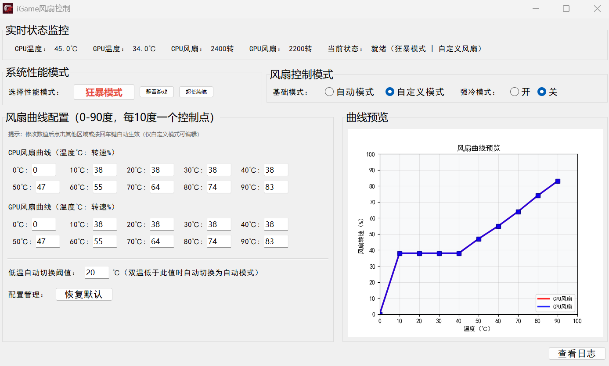
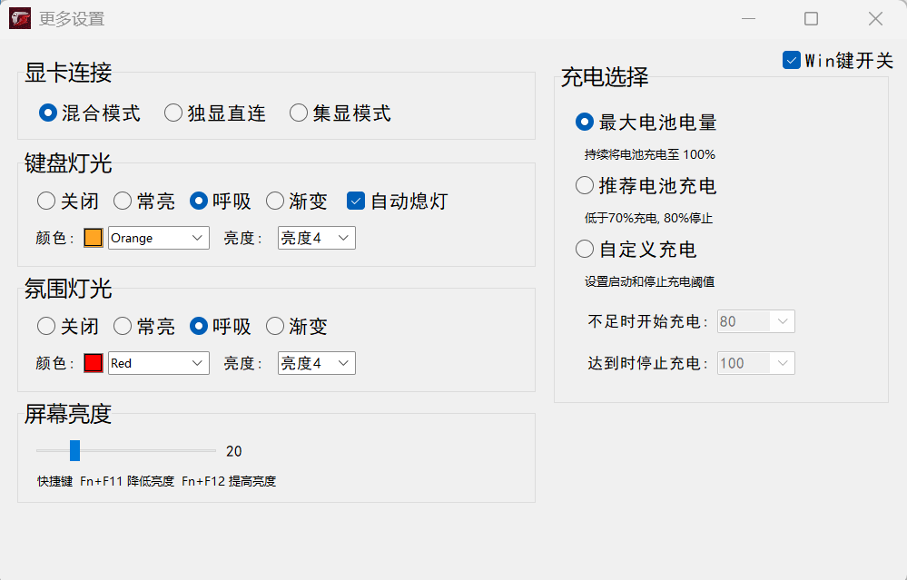

# iGame 风扇控制工具

一款专为七彩虹 iGame 系列笔记本设备设计的风扇控制工具，支持自定义风扇曲线、性能模式切换和实时硬件状态监控，帮助你在性能与静音之间找到最佳平衡。

* **理论兼容**：M15 Origo、M16 Origo、R16 Ultra、X16 Pro

* **实测验证**：M16 Origo（本人自测可用）

## 功能特点

* **实时监控**：实时显示 CPU/GPU 温度、风扇转速及系统状态

* **性能模式切换**：支持 "狂暴模式"、"静音游戏"、"超长续航" 三种预设性能模式

* **灵活风扇控制**：

  * 自动模式：由系统根据硬件负载自动调节风扇

  * 自定义模式：通过温度 - 转速曲线精确控制风扇行为

  * 强冷模式：强制风扇全速运行，快速降温

* **智能温控**：可设置低温阈值，双温低于阈值时自动切换至自动模式

* **配置管理**：支持保存自定义曲线设置，以及恢复默认配置

* **日志记录**：详细记录设备状态和操作日志，便于问题排查

## 界面说明

### 1. 实时状态监控区（顶部）

* 显示 CPU/GPU 实时温度（℃）

* 显示 CPU/GPU 风扇实时转速（转 / 分）

* 显示当前系统性能模式和风扇控制状态

### 2. 模式选择区（中部）

* 系统性能模式：快速切换 "狂暴模式"、"静音游戏"、"超长续航"

* 风扇控制模式：选择 "自动模式" 或 "自定义模式"

* 强冷模式：一键开启 / 关闭风扇全速运行（优先级高于其他模式）

### 3. 曲线配置区（左侧）

* CPU/GPU 风扇曲线：设置 0-90℃区间（每 10℃一个控制点）的目标转速百分比

* 低温阈值：双温低于该值时自动切换至自动模式（默认 20℃）

* 配置管理：支持恢复默认风扇曲线和设置

### 4. 曲线预览区（右侧）

* 可视化展示 CPU（红色）和 GPU（蓝色）的温度 - 转速曲线

* 实时更新曲线变化，直观预览调节效果

### 5. 基础功能区（底部）

* 查看日志：打开实时更新的日志窗口，查看设备状态记录和操作历史

## 使用方法

### 基础操作

1. 启动程序后自动进入监控状态，实时显示硬件信息

2. 点击性能模式按钮（如 "狂暴模式"）切换系统性能策略

3. 通过风扇模式选项选择 "自动模式" 或 "自定义模式"

4. 强冷模式可通过单选按钮快速开启 / 关闭（开启时风扇全速运行）

### 自定义风扇曲线

1. 切换至 "自定义模式"（确保强冷模式为 "关"）

2. 在曲线配置区修改各温度点对应的转速百分比（0-100）

3. 输入完成后点击其他区域或按回车键生效

4. 右侧预览区将实时更新曲线，便于直观调整

### 智能温控设置

1. 在 "低温自动切换阈值" 输入框中设置温度值（建议 15-30℃）

2. 当 CPU 和 GPU 温度均低于该阈值时，系统自动切换至自动模式

3. 温度回升后，自动恢复为自定义模式

### 日志查看

点击界面底部 "查看日志" 按钮，可打开实时更新的日志窗口，查看设备状态记录和操作历史。

## 注意事项

* 程序需要管理员权限才能正常控制硬件，请以管理员身份运行

* 强冷模式启用时，自定义曲线设置暂时失效

* 关闭程序时会自动恢复默认风扇模式，避免硬件长期处于非默认状态

* 配置文件（`fan_config.json`）和日志文件保存在程序目录下

## 常见问题

* **无法控制风扇**：检查是否以管理员身份运行，确认设备驱动已正确安装

* **数据显示异常**：尝试重启程序，或查看日志文件排查错误原因

* **配置丢失**：配置文件保存在程序目录，若丢失可通过 "恢复默认" 重新生成

## 免责声明

本工具仅用于辅助控制风扇，过度调整参数可能影响硬件寿命。使用本工具即表示您了解相关风险，并自行承担使用责任。

***

## V1.1 更新说明

### 1、系统托盘功能

#### 功能介绍

程序运行时最小化后，将常驻系统托盘（任务栏右侧通知区域），避免占用桌面空间，同时支持快速操作，无需重新打开主窗口。

#### 操作方法

1. **最小化至托盘**：点击主窗口右上角 "最小化" 按钮，程序自动隐藏至系统托盘

2. **托盘图标操作**：

* 左键点击托盘图标：快速显示主窗口

* 右键点击托盘图标：弹出操作菜单，包含 "显示窗口"、"启动设置"、"退出程序" 选项

1. **退出程序**：右键托盘图标选择 "退出程序"，程序将恢复默认风扇模式后退出

### 2、开机自启动设置

#### 功能介绍

支持设置程序随 Windows 系统开机自动运行，无需每次手动启动，提升使用便捷性。

#### 操作方法

1. 打开程序主窗口，在底部 "启动设置" 区域勾选 "开机自启动" 选项

2. 勾选后，程序将自动添加至系统启动项，下次重启电脑时会自动运行

3. 取消勾选：再次取消 "开机自启动" 选项，即可从系统启动项中移除，下次开机不再自动运行

### 3、启动时最小化设置

#### 功能介绍

支持设置程序启动后自动最小化至系统托盘，不显示主窗口，适合希望后台运行、不干扰桌面操作的场景。

#### 操作方法

1. 在程序主窗口底部 "启动设置" 区域勾选 "启动时最小化" 选项

2. 勾选后，下次启动程序时，将直接最小化至系统托盘，仅在托盘显示图标

3. 取消勾选：取消该选项后，下次启动程序将正常显示主窗口

#### 搭配使用建议

* 可同时勾选 "开机自启动" 和 "启动时最小化"，实现程序后台自动运行，完全不占用桌面空间

* 启动后若需调整设置，只需左键点击托盘图标即可调出主窗口

### 4、非功能性更新

* 软件目录结构优化，软件运行日志集中保存到logs文件夹中，避免长期运行后日志文件在软件主文件夹中堆积

***

## V1.2 更新说明
### 1、更多设置
V1.2 版本，复刻了官方控制台核心控制功能，内容如图：

### 2、修复上一版本的BUG
1. 键盘开启强冷模式软件仍按自定义模式调速问题，已修复

2. 低温阈值自动风扇模式切换问题，已修复

3. 集显模式下的自定义模式调速问题，已修复

### 3、其他小功能更新
1. CPU和GPU风扇同速模式开关

2. 可以保存选择的自动风扇模式了，下次启动时可以自动恢复到该模式

### 4、已知问题
1. 充电选择模式不生效。本人机器上用官方控制台设置做了对比，发现也不生效。

2. 官方控制台里的设置软件里未同步更新。

## 版本更新日志

| 版本更新 | 新增功能  | 功能说明                      |
|------|-------|---------------------------|
| V1.0 | 第一个版本 | 风扇控制基本功能                  |
| V1.1 | 系统托盘  | 启动时最小化、开机启动               |
| V1.2 | 更多设置  | 复刻官方控制台核心功能（显卡连接、灯光控制等） |